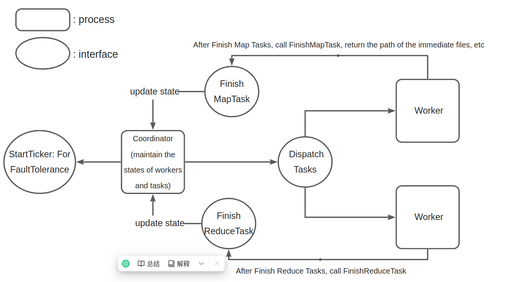

# goMapReduce

A simple implementation of the MapReduce in golang

## Project Structure

```txt
.
├── LICENSE
├── README.md
└── src                 # Source directory containing all the Go source files and modules
    ├── go.mod          # Go module file defining the module's path and its dependencies
    ├── main            # Directory for the main entry point of the mapreduce program
    │   ├── input       # Directory containing input text files, each representing a split for mapreduce
    │   │   ├── pg-being_ernest.txt
    │   │   ├── pg-dorian_gray.txt
    │   │   ├── pg-frankenstein.txt
    │   │   ├── pg-grimm.txt
    │   │   ├── pg-huckleberry_finn.txt
    │   │   ├── pg-metamorphosis.txt
    │   │   ├── pg-sherlock_holmes.txt
    │   │   └── pg-tom_sawyer.txt
    │   ├── mrcoordinator.go               # Go source file for the MapReduce coordinator, which manages tasks and workers
    │   ├── mrsequential.go                # Go source file for running the MapReduce tasks sequentially for debugging or testing
    │   ├── mrworker.go                    # Go source file for the MapReduce worker, which executes tasks assigned by the coordinator
    │   ├── run.sh                         # Shell script for running the MapReduce program for debugging purposes
    │   └── test-mr.sh                     # Shell script for testing the MapReduce implementation
    ├── mr                  # Directory containing the core implementation of MapReduce
    │   ├── coordinator.go  # Go source file for the coordinator logic, handling task scheduling and worker communication
    │   ├── rpc.go          # Go source file for setting up remote procedure calls (RPC) between the coordinator and workers
    │   └── worker.go       # Go source file for the worker logic, handling the execution of map and reduce tasks
    └── mrapps              # Directory containing various MapReduce application implementations
        ├── crash.go
        ├── early_exit.go
        ├── indexer.go
        ├── jobcount.go
        ├── mtiming.go
        ├── nocrash.go
        ├── rtiming.go
        ├── wc.go
```

## Project Architecture Diagram


## Usage

use wc.so existing in the mrapps directory as an example

1. Start the Coordinator and tell it the input file path

```sh

cd src/main

./run.sh 
```

2. Open another terminal, start the Worker process

```sh
go run worker.go wc.so
```

3. The immediate files(mr-[map_id]-[reduce_id]) and output files(mr-out-[reduce_id]) will be generated in the current directory


## Reference

This project is strongly referenced by lab1 of the [MIT 6.5840, Distributed Systems](https://pdos.csail.mit.edu/6.824/).
